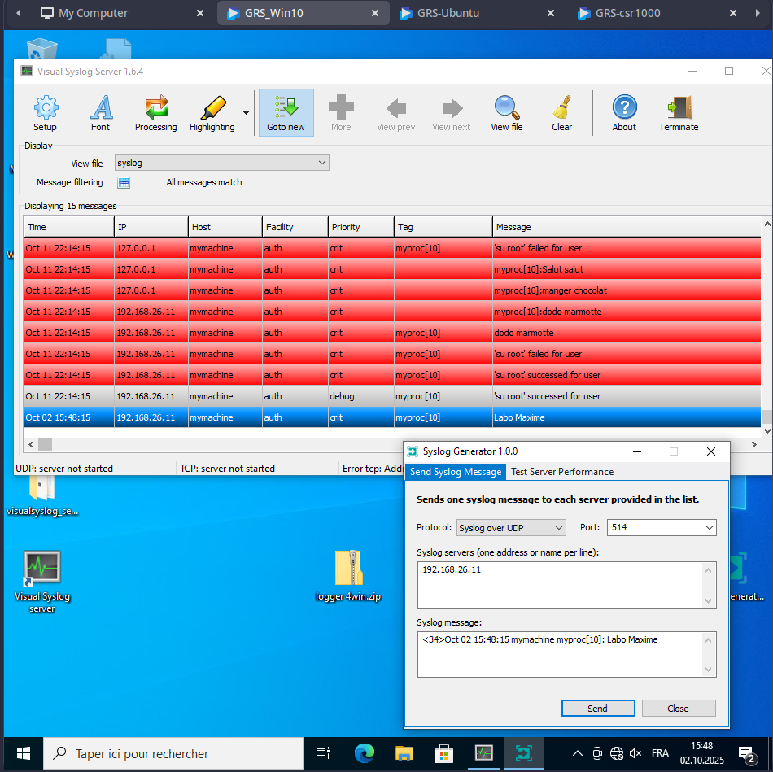
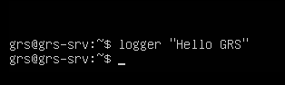
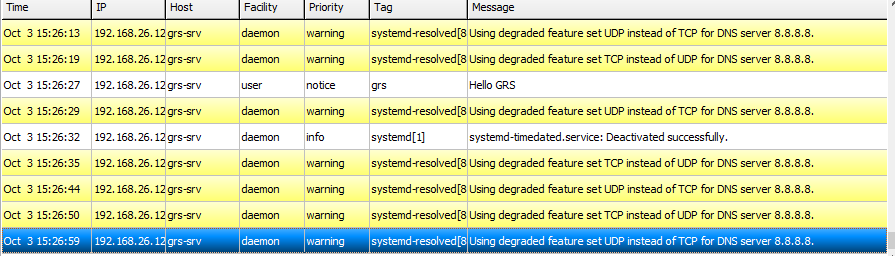
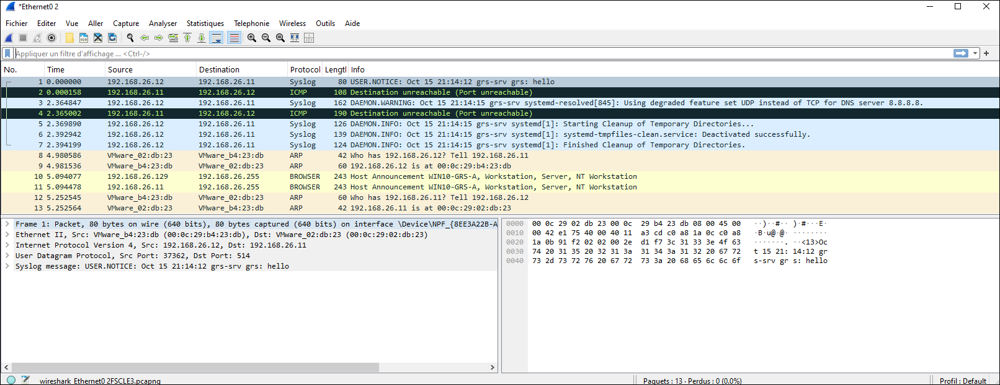

Lestiboudois Maxime
Berberat Alex
# GRS - Lab01 - Rapport

## Partie 1 - Configurer un serveur Syslog
Sur le noeud PC Windows 10
---
Démarrez le serveur Visual Syslog Server.

Lancez SyslogGenerator. A l’aide de cet outil vous pouvez tester que votre serveur
Syslog reçoit bien les messages générés localement. Faites quelques tests avec différents
types de message et notamment un message contenant votre nom.
 >1. Montrez, avec une copie d’écran, les événements reçus par votre serveur Syslog
 

## Partie 2 - Configurer un client Linux
Sur le noeud Linux
---

Configurer Syslog (rsyslog), en modifiant le fichier de configuration qui se trouve dans le
répertoire /etc/rsyslog.conf/ pour qu’il redirige les logs sur le serveur situé sur le PC
Windows 10 (Port UDP 514).
>2. Montrez votre fichier de configuration (les commandes importantes)

La ligne importante à ajouter dans le fichier de configuration est la suivante:
```
*.* @192.168.26.11:514
```
Elle permet de rediriger les log de la machine linux vers la machine Windows 10, qui possède l'adresse ip statique 192.168.26.11, sur le port 514

---

Générez des messages depuis la VM Linux (reboot, sudo et en utilisant la commande
logger) et capturez simultanément le trafic Syslog à l’aide de Wireshark.
>3. Montrez les messages reçus sur la console du serveur Syslog distant (Windows
10).

Log envoyé depuis la machine Linux:


Log reçu sur Windows 10:



>4. Donnez plusieurs exemples de messages qui vous semblent utiles dans la gestion
des réseaux.

Messages utiles pour la gestion:
- Connexion SSH échouée ou réussie
- Tentatives sudo 
- Messages kernel (erreur réseau, problème de disque, etc)
- Log de service critique
- Alertes de firewall


>5. Que pouvez-vous dire sur la sécurité des échanges de messages Syslog ?

Les messages Syslog ne sont pas sécurisé (chiffrement, authentification). 
Un attaquant pourrait: 
- falsifier -> envoie de faux messages d'erreur
- intercepter -> écoute réseau pour se renseigner sur l'architecture

De plus UDP étant utilisé par défaut il pourrait aussi y avoir de la perte de paquet.

---
6. Pas celle là - FYI
---

>6. Présentez et expliquer la captures wireshark d’un message Syslog.


Prenons notre message envoyé précédemment `Hello GRS`:

On peut donc remarquer qu'un message wireshark contient plusieurs champs nous indiquand plusieurs types d'information: \
**Time**: indique la date et l'heure à laquelle le message a été émis. \
**IP**: indique l'adresse Ip source du message. \
**Host**: indique le nom de l'entité qui a envoyé. le message \
**Facility**: Les différentes catégories de messages et permettent de classer les logs selon leur source.

Liste des Facilities standards Syslog:
|Facility||
|:------:|:--|
|kern|messages du noyau Linux|
|user|messages générés par les utilisateurs/applications|
|mail|système de messagerie|
|daemon|processus en arrère-plan(services système)|
|auth/authpriv|authentification et autorisation (login, sudo, ssh, etc)|
|syslog|messages générés par le daemon syslog lui-même|
|lpr|système d'impression|
|news|serveurs de news (NNTP, usenet)|
|crpm|tâche planifiées|
|ftp|serveur FTP|
|local0 à local7|réservé à un usage local ou personnalisé|

**Priority**: indique la priorité du message
|Priority|Code||
|:------:|:--:|:--|
|emerg|0|Situation d'urgence: le système est inutilisable, ex: Kernel Panic|
|alert|1|Action immédiate requise, ex: disque plein, service critique HS, etc|
|crit|2|Erreur critique du système ou d'un service|
|err|3|Erreur standard, ex échec d'une commande, problème applicatif|
|warning|4|Avertissement, anomalie non bloquante|
|notice|5|Information importante mais pas une erreur|
|info|6|Message informatif général|
|debug|7|Message de debug très détaillé, utilisé pour le diagnostic|

**Tag**: ne représente pas une catégorie officielle, mais servent à identifier quelle application ou processus a généré le log. \
**Message**: donne le contenu du log

En prenant le message que nous avons envoyé précédemment depuis le noeud Linux et en le lisant depuis wireshark sur Windows, nous pouvons dire:
- Il a été envoyé le 3 ocotobre à 15h26min27sec.
- L'adresse ip l'ayant envoyé est la 192.168.26.12 (soit notre noeud linux).
- Le host l'ayant envoyé est `grs-srv, soit encore notre noeud linux.
- La facility est `user`, c'est donc u message généré r l'utilisateur ou un application (première option ici).
- La priority est notice, soit d'ordre 5: l'information est importante mais n'est pas une erreur.
- Le tag est `grs`.
- Le message contient `Hello GRS`.

---
6. Celle là
---


On retrouve:
 - La source IP : 192.168.26.12 (celui qui envoie)
 - Le port source: 37362
 - La destination IP: 192.168.26.11 (celui qui reçoit)
 - Le port destination: 514
 - Le protocole: Syslog
 - La longueur : 80
 - Le message Syslog: "USER.NOTICE: Oct 15 21:14:12 grs-srv grs:hello"
  
Dans le message, on retrouve:
- La facility: USER.NOTICE
- Le Header: "Oct 5 21:14:12 grs-srv", qui indique la date ainsi que le nom de l'hôte émetteur
- le Message: "grs: hello", qui est le contenu du message


---

>7. Modifiez votre configuration afin que les messages Syslog générés par la commande
`sudo` (et exclusivement ceux-ci) soient stockés dans le fichier local
`/var/log/sudos.log`

Il faut ajouter dans le fichier `/etc/rsyslog.conf` les lignes suivantes :
```
if ($programname == 'sudo') then {
    action(type="omfile" file="/var/log/sudos.log")
    stop
}
```

avant la ligne de redirection ajoutée précédemment:
```
*.* @192.168.26.11:514
```
## Partie 3 - Configurer Syslog sur un équipement réseau
**Sur le noeud Cisco**
---
Configurez votre routeur de manière à récupérer les messages de niveau Debug, en tant
que Local_3, sur votre serveur Syslog. 
>8. Montrer les commandes IOS que vous avez utilisé.

```
enable
conf t
logging on
logging host 192.168.26.11 #adresse du serveur syslog de windows
logging facility local3
logging trap debugging
end
write memory
```
---

Configurer votre routeur afin qu’il soit possible d’assurer une corrélation précise (précision
à la milliseconde) des événements reçus par le serveur Syslog, en utilisant le protocole
NTP.
>9. Montrer les commandes IOS que vous avez utilisé.
```
enable 
conf t
ntp server 192.168.26.11
service timestamps log datetime msec
end
write memory
```

---

Configurez votre routeur Cisco de manière à récupérer un message contenant la commande utilisée, lors d’une modification de la configuration. Par hypothèse, les logs sont maintenant fixés au niveau Warning et plus Debug.
>10. Montrer les commandes IOS que vous avez utilisé.
```
enable
conf t 
logging trap warnings
archive
log config
logging enable
notify syslog
end
write memory
```


>11. Montrer le message reçu

Juste après avoir activer le logging ce message a été reçu.

[images](img_q11.png)


## Partie 4 - Rediriger les événements Windows sur un serveur Syslog
Sur le noeud Windows 10
---

A l’aide de la commande logger.exe, envoyez un message à votre serveur Syslog.
>12. Montrez la commande et le message reçu sur le serveur Syslog
```
logger.exe -l 192.168.45.12 -a 514 "Test logger"
```

[Message à mettre](img_q12.png)

---
Générez un message Syslog à l’aide de la cmdlet Send-SyslogMessage (module PoshSYSLOG) en mode RFC 3164 et 5424 et comparez les messages

>13. Montrez la commande utilisée et les messages reçus par le serveur Syslog
```
# Pour RFC 5424 (par défaut)
Send-SyslogMessage -Server 192.168.45.12 -Message "Test rfc" -Facility syslog -Severity Informational

# Pour RFC 3164
Send-SyslogMessage -Server 192.168.45.12 -Message "Test rfc" -Facility syslog -Severity Informational -RFC3164
```
Logs reçus:  
[IMage](img_q13.png)


---

Créez un script PowerShell qui vérifie toutes les 2 minutes la présence d’un processus p (par
exemple cmd.exe) et qui génère un message Syslog en cas d’absence.

>14. Montrez le contenu du script et le message reçu par le serveur Syslog
```powershell
$SyslogServer = "192.168.45.12"
$ProcessName = "cmd"
$msg = "cmd.exe not running"
$interval = 120

while ($true) {
    # check if cmd.exe is not running
    if(-not (Get-Process -Name $ProcessName -ErrorAction SilentlyContinue)) {
        #if not running, send syslog
        Send-SyslogMessage -Server $SyslogServer -Facility syslog -Severity Error -Message $msg
    }
    # sleep for specified interval
    Start-Sleep -Seconds $interval
}
```

```
#Pour exécuter le script dans Windows
Set-ExecutionPolicy RemoteSigned  #Commande PowerShell

#lancer le script
C:\Scripts\Check-Process-Syslog.ps1

```
[Image](img_q14.png)


---

A l’aide de https://www.solarwinds.com/free-tools/event-log-forwarder-for-windows ou le
cmdlet Send_syslogMessage:\
Redirigez, vers le serveur Syslog, l’événement Windows (Observateur d’événements) liés à
un échec de login local.

>15. Montrez le bon fonctionnement de la redirection à l’aide d’une copie d’écran du
serveur Syslog

1) Installe le module:
```
Install-Module -Name Posh-SYSLOG
Import-Module Posh-SYSLOG
```
2) Dans le journal des événements de Windows 10, on trouve que les échecs de connexion sont d'ID 4625
-> dans Journaux Windows -> Sécurité : faire un clic droit sur l'ID de l'événement 4625 et cliquer sur **Joindre une tâche à cet événement...**
-> dans la section **Action** de l'assistant, choisir **Démarrer un programme**
3) Ajouter le chemin de l'exécutable PowerShell: C:\Windows\System32\WindowsPowerShell\v1.0\powershell.exe
4) Puis ajouter l'argument qui permet de choisir le script: -File "C:\Users\labo\Desktop\script2.ps1"
5) Créer le script à l'endroit choisi précédement: C:\Users\labo\Desktop\script2.ps1
   ```
    Sens-SyslogMessage -Message "Erreur de login local - Test GRS" -Server "192.168.26.11" -Port 514 -Severity Informational -Facilits syslog
   ```
6) Test en verrouillant la session windows et en se trompant de mot de passe
   
 [Image](img_q15.png)  


## Partie 5 - Utilisation de Sysmon
Sur le noeud Windows 10
---

Installez l’extension sysmon (Microsoft Sysinternals) et configurez-le, via un fichier XML, de
manière que les connexions vers le port 80 et les requêtes DNS sur le site lematin.ch
soient journalisée et visible dans l’Observateur d’événements.
>16. Montrez le contenu de votre fichier XML.
```
<Sysmon schemaversion="4.82"> <!-- Si ça marche pas, essayer la version 4.30 -->
    <EventFiltering>

    <NetworkConnect onmatch="include">
        <DestinationPort>80</DestinationPort>
    </NetworkConnect>

    <DnsQuery onmatch="include">
      <QueryName>lematin.ch</QueryName> <!-- ou <QueryName condition="contain">lematin.ch</QueryName> -->
    </DnsQuery>
    </EventFiltering>
</Sysmon>

```

>17. Montrez le message reçu.

[Image]() -> Aller dans **Journaux des applications et des services** -> **Microsoft** -> **Windows** -> **Sysmon** -> **Operational**