# GRS - Lab02
## Objectif 
*Installer/configurer les agents SNMP en mode v2.*

• Activez l’agent SNMP sur la machine Windows 10. Le paramétrage s’effectue au niveau du
service correspondant. Définissez le community string en mode RO avec la valeur choisie à l’objectif 2 (par exemple heig).
> 1. Montrez à l’aide de captures d’écran les changements de configuration que vous avez réalisés

**Réponse:**

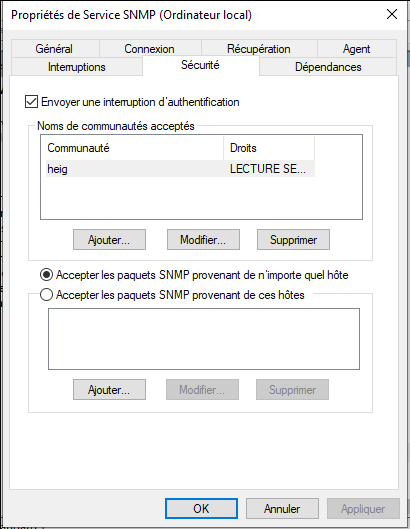

• A l’aide du browser SNMPb, interrogez le localhost.
> 2. Montrez les valeurs retournées par les 5 objets SysDescr, SysName, SysUpTime,
ifNumber, et l’adresse IP de votre cible. \
Vérifiez si les données retournées via SNMP correspondent à la réalité du système cible (Windows).

**Réponse:**

<u>SysDescr:</u>

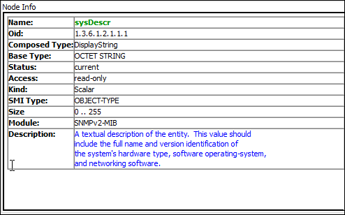

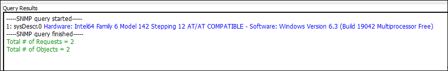


<u>SysName:</u>

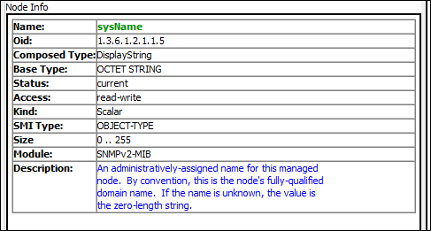

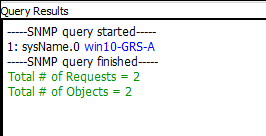

<u>SysUpTime</u>

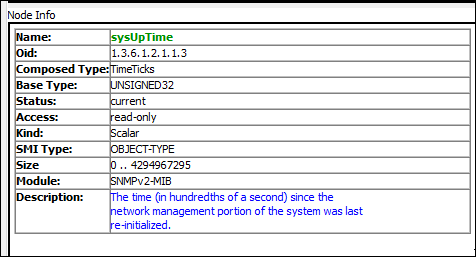

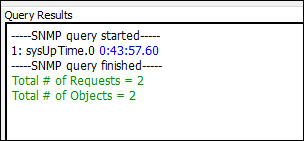

<u>ifNumber</u>

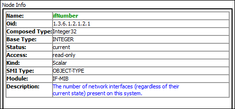

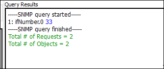


<u>adresse IP</u>

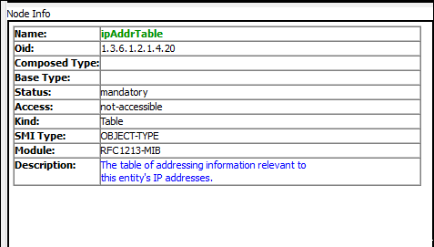

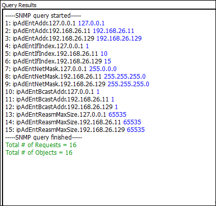


• Activer et configurez l’agent SNMP sur le routeur Cisco \
• Activer et configurez l’agent SNMP sur le routeur Cisco

> 3. Montrez la configuration du routeur cisco de manière à ce qu’il puisse être géré via
SNMPv2 (choisissez ciscoRO comme community string read only et ciscoRW
comme community string read write).
Configurez également le routeur pour qu’il envoie ses traps snmp au manager SNMPb sur Windows. Prévoyez la synchro temps et l’affichage des événements en ms.

A faire:
```
snpm-server community ciscoRO ro
snmp-server comminity ciscoRW rw
snmp-server enable traps
snmp-server enable traps snmp authentication
```

**Réponse:**
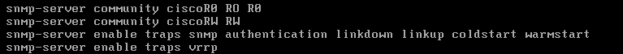


> 4. Montrez les valeurs retournées par les 5 objets SysDescr, SysName, SysUpTime, sysObjectID, ainsi l’adresse IP de votre cible (obtenue via SNMP)

**Réponse:**

<u>SysDescr</u>
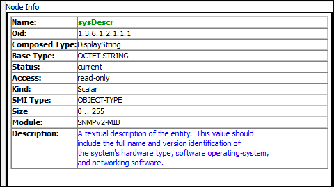

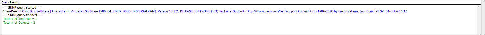

<u>SysName</u>

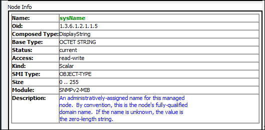


<u>SysUpTime</u>

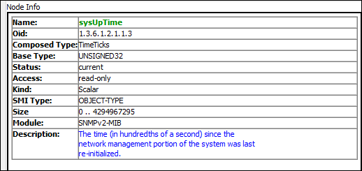

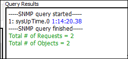

<u>sysObjectID</u>

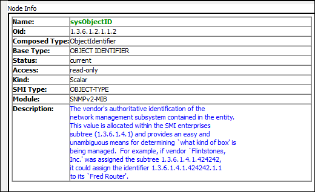


<u>adresse IP</u>

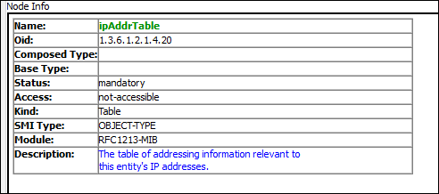

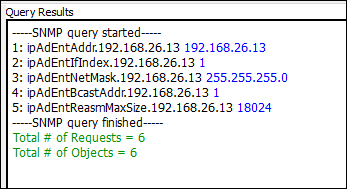

> 5. A quoi sert/correspond la valeur retournée par sysObjectID ? Que vous manque-t-il pour l’interpréter correctement ?

**Réponse:**

La valeur renvoie une partie de l'OID, identifiant le constructeur et le modèle de l'équipement. Il manque la racine complète (1.3.6.1.4.1) et le fichier MiB du constructeur.

> 6. A l’aide de Wireshark, capturez et présentez de manière lisible les trames lorsque la machine Windows 10 interroge le routeur Cisco pour obtenir le nom de l’équipement
(les champs concernant SNMP doivent être visibles et commentés).

**Réponse:**

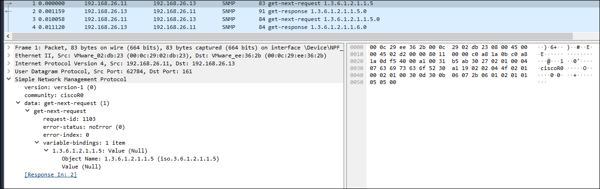

• Changez le nom (hostname) du routeur à l’aide de l’application SNMPb (nouveau nom :
router-<votre-nom>) tout en capturant avec Wireshark les messages échangés.


> 7. Montrez et analysez l’échange de messages capturés par Wireshark.


**Réponse:**


• Générez une trap SNMP en déclenchant un événement sur votre routeur (un peu d’imagination...) tout en capturant avec Wireshark les messages échangés.


> 8. Montrez les messages (traps) reçus par l’application SNMPb.

**Réponse:**


>9. Analysez les trames de la capture précédente et décodez la signification des différents messages SNMP en recherchant la signification du « OID code » à l’aide du SNMP
Object Navigator Cisco.

*[https://snmp.cloudapps.cisco.com/Support/SNMP/do/BrowseOID.do](https://snmp.cloudapps.cisco.com/Support/SNMP/do/BrowseOID.do)* \
*(compte Cisco à créer si nécessaire)*

**Réponse:**


> 10. Montrez la configuration de votre routeur afin qu’il n’accepte des requêtes SNMP que de la part de votre machine Windows uniquement.

**Réponse:**


• Afin d’intégrer votre nœud linux à votre environnement de gestion, activez et configurez SNMP sur votre nœud Linux.

> 11. Montrez le(s) fichier(s) de configuration nécessaire à la configuration de SNMP sur votre nœud Linux (même community string que pour Windows.).

**Réponse:**


> 12. Montrez le résultat dans SNMPb d’une requête permettant de connaître la durée de
fonctionnement de votre nœud Linux.

**Réponse:**


• Windows Powershell permet de créer des scripts, utiles pour récupérer des informations de manière régulière et automatisée par exemple.

> 13. Montrez la commande (par exemple via l’installation du module SNMP) utilisée depuis Windows pour récupérer le nom de votre routeur Cisco.

**Réponse:**


> 14. Montrez la commande ou le script utilisé pour récupérer toutes les minutes la liste des processus/programmes actifs sur votre machine Windows.

*Intégrez le fichier MIB standard HOST-RESSOURCES-MIB à SNMPb (fourni par SNMPb) pour déterminer les OID à utiliser.*


**Réponse:**


## Objectif 4 : MIBs privées

• Afin d’interroger des objets spécifiques à votre équipement, vous avez besoin d’intégrer à votre manager SNMP (l’application SNMPb) les MIB privées nécessaires. \\
Vous désirez obtenir des informations sur la mémoire flash embarquée sur votre routeur : chargez les MIBs privées nécessaires

> 15. Donnez la liste des fichiers MIBs que vous avez chargé et expliquez comment vous
avez déterminé ce choix.

**Réponse:**


> 16. Montrez, via une requête SNMPb, le nom des 10 premiers fichiers stockés sur la
mémoire flash de votre routeur Cisco.

**Réponse:**


## Objectif 5 : Configurer les agents SNMP en mode v3

La version 3 de SNMP ajoute des capacités de chiffrement et d’authentification « forte ».

> 17. Montrez la configuration de votre router afin qu’il n’accepte plus que des requêtes SNMPv3 en mode authentifié et chiffré.

**Réponse:**


> 18. Montrez la configuration en mode SNMPv3 de votre application SNMPb et montrer le
résultat d’une requête sur la valeur SysUpTime (MIB-2) en SNMPv3.


**Réponse:**


> 19. Capturez/analysez les messages lors d’une requête SNMP v3.

**Réponse:**


> 20. Quelle(s) bonne(s) pratique(s) supplémentaires suggérez-vous pour sécuriser votre trafic SNMP v3 ?

**Réponse:**


## Objectif 6 : Utilisation de WMI

Vérifiez que le service WMI est fonctionnel sur votre machine Windows.
Pour des questions de simplification de l’infrastructure du laboratoire, la console WMI et l’agent WMI se trouvent sur la même machine. \\
L’accès à un agent WMI distant nécessite le réglage des autorisations, notamment au niveau DCOM.

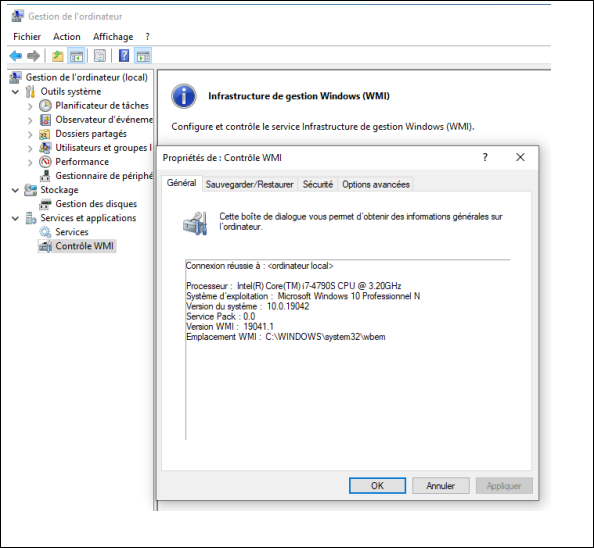


• A l’aide de WMI explorer, retrouver les caractéristiques du processeur de votre VM
Windows ainsi que le SID de votre utilisateur local.


> 21. Montrez le résultat avec une capture d’écran.

**Réponse:**


• Ecrivez un script PowerShell permettant de lister, à l’aide de WMI, les partitions de la VM Windows avec leur lettre de lecteur et de retourner le pourcentage d’espace vide.
En cas d’espace insuffisant, une alarme Syslog est générée et récupérée sur votre serveur Syslog.

> 22. Montrez votre script.

**Réponse:**


> 23. Montrez le résultat (valeurs obtenues et message Syslog reçu).


**Réponse:**


• Etablissez une souscription permanente à un événement lorsqu’un périphérique USB est
inséré dans votre système. Une notification est visible dans l’observateur d’événements. 

> 24. Montrez votre commande.


**Réponse:**


> 25. Montrez l’événement reçu.

**Réponse:**