# GRS - Lab02
## Objectif 3 : Configurer les agents SNMP en mode v2
*Installer/configurer les agents SNMP en mode v2.*


- Activez l’agent SNMP sur la machine Windows 10. Le paramétrage s’effectue au niveau du service correspondant. Définissez le community string en mode RO avec la valeur choisie à l’objectif 2 (par exemple heig).
> 1. Montrez à l’aide de captures d’écran les changements de configuration que vous avez réalisés

> [!warning]
> Il faudrait pas mettre `povenant de ces hôtes` avec juste `localhost` dedans ?


#### **Réponse:**


---
---

- A l’aide du browser SNMPb, interrogez le localhost.
> 2. Montrez les valeurs retournées par les 5 objets SysDescr, SysName, SysUpTime,
ifNumber, et l’adresse IP de votre cible. \
Vérifiez si les données retournées via SNMP correspondent à la réalité du système cible (Windows).

#### **Réponse:**

<u>SysDescr:</u>


<u>SysName:</u>


<u>SysUpTime</u>


<u>ifNumber</u>


<u>adresse IP</u>


---
--- 

- Activer et configurez l’agent SNMP sur le routeur Cisco 

> 3. Montrez la configuration du routeur cisco de manière à ce qu’il puisse être géré via
SNMPv2 (choisissez ciscoRO comme community string read only et ciscoRW
comme community string read write).
Configurez également le routeur pour qu’il envoie ses traps snmp au manager SNMPb sur Windows. Prévoyez la synchro temps et l’affichage des événements en ms.

A faire:
```
snpm-server community ciscoRO ro
snmp-server comminity ciscoRW rw
snmp-server enable traps
snmp-server enable traps snmp authentication
```

> [!warning]
> je crois qu'il manque des bouts,
> genre `srv host <ip> ...`


#### **Réponse:**


---

> 4. Montrez les valeurs retournées par les 5 objets SysDescr, SysName, SysUpTime, sysObjectID, ainsi l’adresse IP de votre cible (obtenue via SNMP)

#### **Réponse:**

<u>SysDescr</u>


<u>SysName</u>


<u>SysUpTime</u>


<u>sysObjectID</u>


<u>adresse IP</u>


---

> 5. A quoi sert/correspond la valeur retournée par sysObjectID ? Que vous manque-t-il pour l’interpréter correctement ?


> [!warning]
> a completer

#### **Réponse:**

La valeur renvoie une partie de l'OID, identifiant le constructeur et le modèle de l'équipement. Il manque la racine complète (1.3.6.1.4.1) et le fichier MiB du constructeur.

---

> 6. A l’aide de Wireshark, capturez et présentez de manière lisible les trames lorsque la machine Windows 10 interroge le routeur Cisco pour obtenir le nom de l’équipement
(les champs concernant SNMP doivent être visibles et commentés).


> [!warning]
> ajouter commentaire  
> faut 2 img: request, response


#### **Réponse:**


---
---

- Changez le nom (hostname) du routeur à l’aide de l’application SNMPb (nouveau nom : `router-<votre-nom>`) tout en capturant avec Wireshark les messages échangés.

> [!tip] 
> #### Steps:
> 1. Depuis SNMPb faire `Set sysName` avec `router-<votre-nom>`
> 2. Avec Wireshark capturer `SNMP set-request` et `SNMP get-response`
> 3. Add explication 


> 7. Montrez et analysez l’échange de messages capturés par Wireshark.

#### **Réponse:**
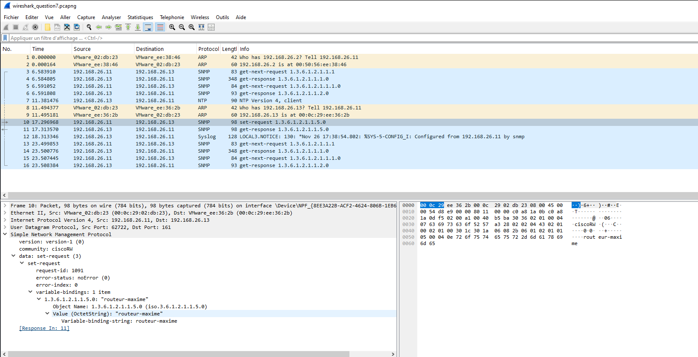
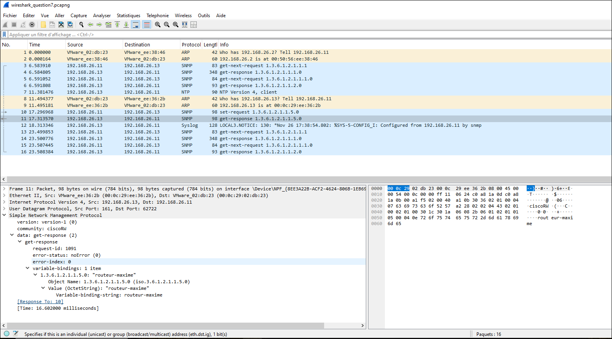

On remarque que les demandes de paquets sont des `get-next-request`, le routeur répond avec des `get-response`. Lors du changement de nom du routeur depuis l'application SNMPb, Windows envoie un `set-request` et le routeur répond par une `get-response`basique. 

>[!warning]
>TO COMPLETE


---
--- 

- Générez une trap SNMP en déclenchant un événement sur votre routeur (un peu d’imagination...) tout en capturant avec Wireshark les messages échangés.


> [!tip] 
> #### Steps:
> 1. Sur le routeur: la cmd `test snmp trap ?` permet lister les tests qui existe
> 2. En choisir un exemple: `test snmp trap entity`
> 3. Faire capture avec Wireshark (UDP 162, snmpv2-trap)
> - Pour 8.
>   1. Dans SNMPb aller dans Traps et trouver celle qui vient d'être intercepté
> - Pour 9.
>   1. Mettre capture écran WS
>   2. Ajouter explication avec lien donné


> 8. Montrez les messages (traps) reçus par l’application SNMPb.

#### **Réponse:**
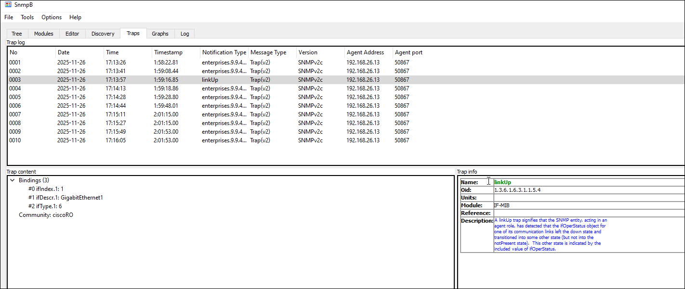

>[!warning]
> Faire analyse

---

> 9. Analysez les trames de la capture précédente et décodez la signification des différents messages SNMP en recherchant la signification du « OID code » à l’aide du SNMP Object Navigator Cisco.

*[https://snmp.cloudapps.cisco.com/Support/SNMP/do/BrowseOID.do](https://snmp.cloudapps.cisco.com/Support/SNMP/do/BrowseOID.do)* \
*(compte Cisco à créer si nécessaire)*

#### **Réponse:**

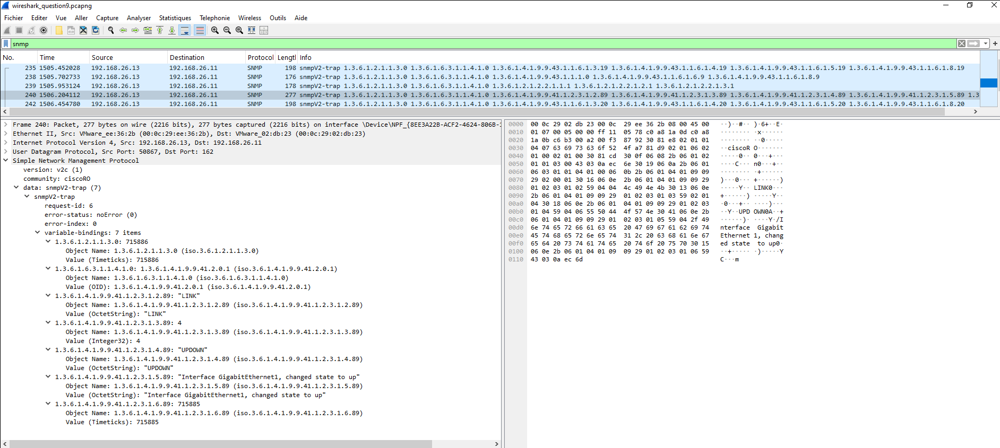
>[!warning]
> Faire analyse

---

> 10. Montrez la configuration de votre routeur afin qu’il n’accepte des requêtes SNMP que de la part de votre machine Windows uniquement.

> [!tip] 
> #### Steps:
> (Faudra sûrement mettre dans la résponse les cmd suivantes)
> 1. Config des `acces-list`
>    ```
>    conf t
>    access-list 10 permit <ip du windows>
>    access-list 10 deny any
>    snmp-server community ciscoRO RO 10
>    snmp-server community ciscoRW RW 10
>    exit
>    copy run start
>    ```
> 2. Vérifier  
>    `show access-lists`   
>    `show snmp`  
>    j'ai aussi trouvé ces cmd mais je sais pas trop la quelle est meilleur (j'aurais envie de dire la 1ère)

#### **Réponse:**

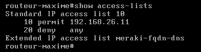


---
---

- Afin d’intégrer votre nœud linux à votre environnement de gestion, activez et configurez SNMP sur votre nœud Linux.


> [!tip] 
> #### Steps:
> 1. installer SNMPd
> 2. éditer `/etc/snmp/snmpd.conf`
> 3. ajouter addr ip de l'interface dans `agentaddress` comme `agentaddress udp:161`
> 4. ajouter une `rocommunity` comme `rocommunity heig <addr win> -V systemonly`
> 5. restart `sudo systemctl restart snmpd`


> 11. Montrez le(s) fichier(s) de configuration nécessaire à la configuration de SNMP sur votre nœud Linux (même community string que pour Windows.).

#### **Réponse:**

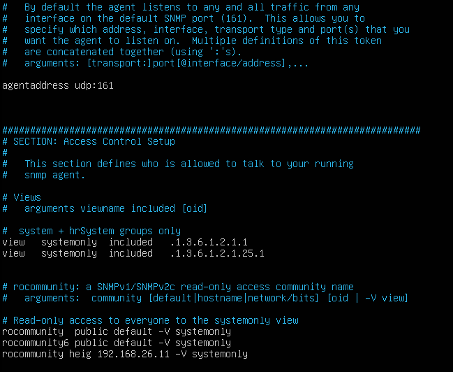

> [!tip] 
> #### Steps:
> screenshot `/etc/snmp/snmpd.conf`


---

> 12. Montrez le résultat dans SNMPb d’une requête permettant de connaître la durée de
fonctionnement de votre nœud Linux.


> [!tip] 
> #### Steps:
> trouver dans SNMPb `sysUpTime` normalement dans `internet/mgmt/mib-2/system/` et mettre screnshot


#### **Réponse:**

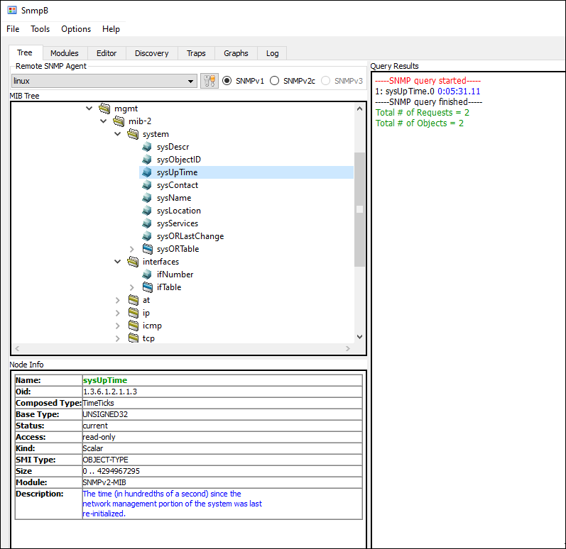


---
---

- Windows Powershell permet de créer des scripts, utiles pour récupérer des informations de manière régulière et automatisée par exemple.

> 13. Montrez la commande (par exemple via l’installation du module SNMP) utilisée depuis Windows pour récupérer le nom de votre routeur Cisco.


> [!tip] 
> #### Steps:
> ```sh
> # Install
> Install-Module -Name SNMP
> 
> # Get cmd
> SnmpGet.exe -v:2c -c:"ciscoRO" <ip Cisco> 1.3.6.1.2.1.1.5.0
> ```

```{bash}
#CUISINELLA
$SNMP = New-Object -comObject olePrn.OleSNMP
$SNMP.open('192.168.26.13',ciscoRO',2,1000)
$Result = $SNMP.get('.1.3.6.1.2.1.1.5.0')
$SNMP.Close()
Write-Output "Device name: $Result"
```

#### **Réponse:**

```{bash}
$SNMP = New-Object -ComObject olePrn.OleSNMP
Write-Output "Device name: $($SNMP.open('192.168.26.13','ciscoRO',2,1000) | Out-Null; $SNMP.get('.1.3.6.1.2.1.1.5.0')); $SNMP.Close()"
```

---

> 14. Montrez la commande ou le script utilisé pour récupérer toutes les minutes la liste des processus/programmes actifs sur votre machine Windows.

*Intégrez le fichier MIB standard HOST-RESSOURCES-MIB à SNMPb (fourni par SNMPb) pour déterminer les OID à utiliser.*


> [!warning] 
> vérifier  
> pas sur si correcte 


#### **Réponse:**

```PowerShell
while ($true) {
    Get-SNMPData -IPAddress localhost -Community heig -Walk -OID "1.3.6.1.2.1.25.4.2.1.2"
    Start-Sleep -Seconds 60
}
```
<!--ou 
```PowerShell
while ($true) {
    Write-Output "=== $(Get-Date) ===" >> snmp_processes.log
    snmpwalk.exe -v2c -c public localhost 1.3.6.1.2.1.25.4.2.1.2 >> snmp_processes.log
    Start-Sleep -Seconds 60
}
```-->


## Objectif 4 : MIBs privées

- Afin d’interroger des objets spécifiques à votre équipement, vous avez besoin d’intégrer à votre manager SNMP (l’application SNMPb) les MIB privées nécessaires.  
Vous désirez obtenir des informations sur la mémoire flash embarquée sur votre routeur : chargez les MIBs privées nécessaires

> 15. Donnez la liste des fichiers MIBs que vous avez chargé et expliquez comment vous
avez déterminé ce choix.


#### **Réponse:**

|Fichiers MIBs| Raisons|
|--|--|
|`CISCO-FLASH-MIB`|Cela nous permet d'avoir les informations de la mémoire flash|
|`CISCO-SMI`| C'est une dépendance de CISCO-FLASH-MIB|


---

> 16. Montrez, via une requête SNMPb, le nom des 10 premiers fichiers stockés sur la mémoire flash de votre routeur Cisco.


> [!tip] 
> #### Steps:
> faire un walk sur `ciscoFlashFileName` dans `.../private/entreprises/cisco/ciscoMgmt/ciscoFlashMIBObjects/ciscoFlashDevice/ciscoFlashPartitions/ciscoFlashFiles/ciscoFlashFileTable/ciscoFlashFileEntry/`


#### **Réponse:**

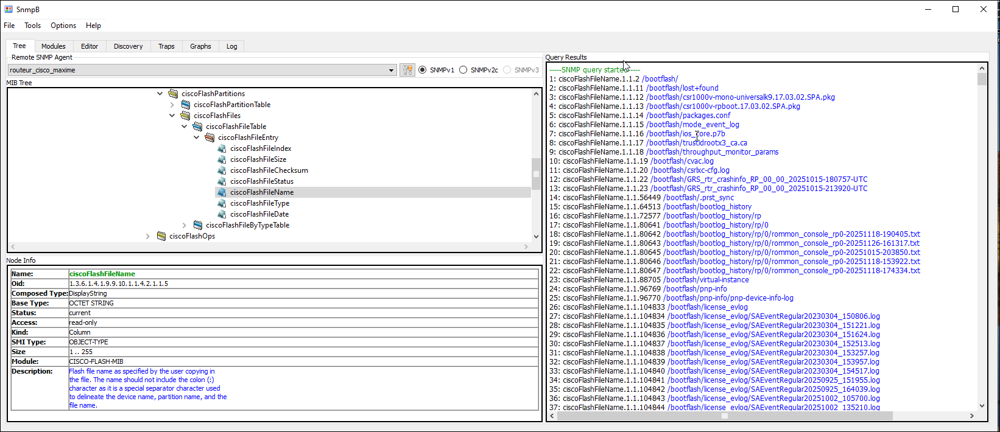
Les 10 premiers fichiers sont donc:
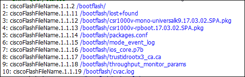


## Objectif 5 : Configurer les agents SNMP en mode v3

La version 3 de SNMP ajoute des capacités de chiffrement et d’authentification « forte ».

> 17. Montrez la configuration de votre router afin qu’il n’accepte plus que des requêtes SNMPv3 en mode authentifié et chiffré.


> [!tip] 
> #### Steps:
> lire la réponse (et ajouter un screen de `show run`) pas sur si utile le screen

> [!warning] 
> remplacer `<ip windows>` par la vrai ip dans la réponse si dessous


#### **Réponse:**

Il faut commencer par supprimé la config SNMP v2:
```sh
# Del SNMP v2 config:
no snmp-server community ciscoRO RO 10
no snmp-server community ciscoRW RW 10
```

Ensuite, configurer SNMP v3:
```sh
# Config SNMP v3
snmp-server group SECURE-GROUP v3 priv
snmp-server user secureuser SECURE-GROUP v3 auth sha pass1 priv aes 128 pass2
snmp-server host 192.168.26.11 version 3 priv secureuser
```


---

> 18. Montrez la configuration en mode SNMPv3 de votre application SNMPb et montrer le résultat d’une requête sur la valeur SysUpTime (MIB-2) en SNMPv3.


> [!tip] 
> #### Steps:
> Faire un screen pour chaque step ou mettre une explication complete
> 1. dans SNMPb ouvrir `USM Profiles` et mettre les credentials 
>       - Secu User Name: `secureuser`
>       - Auth protocol: `SHA`
>       - Auth pass: `pass1`
>       - Privacy Protcol: `AES 128`
>       - Privacy pass: `pass2`
> 2. dans `Agent Profiles` pour `routeur_cisco_maxim` s'assurer que c'est `SNMPV3`
> 3. dans `Agent Profiles` pour `routeur_cisco_maxim/SnmpV3` mettre secu lvl a `authPriv` 
> 4. faire la requête sur `SysUpTime`
>       - utilisé WS pour capturé la requête pour le point 19


#### **Réponse:**

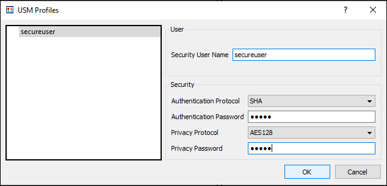

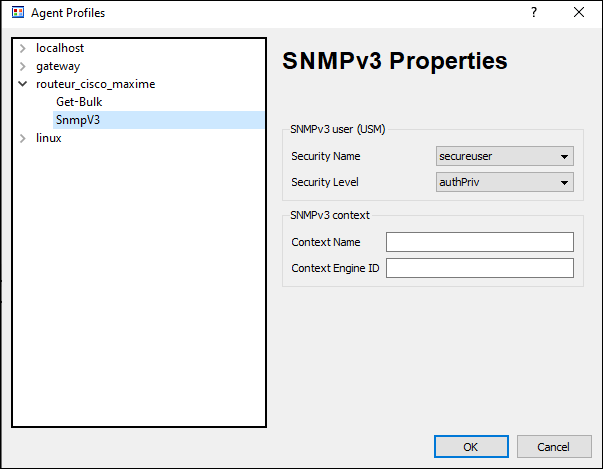

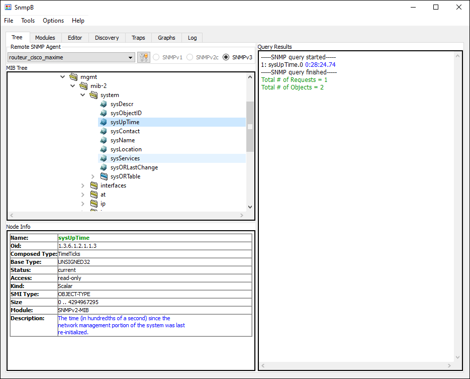


---

> 19. Capturez/analysez les messages lors d’une requête SNMP v3.


> [!tip] 
> #### Steps:
> faire la capture et expliqué tout précisément  
> (explication faisable pendant DAA je pense)


#### **Réponse:**

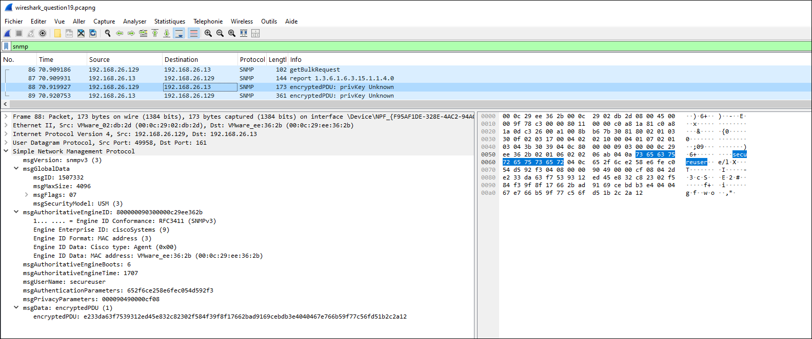


---

> 20. Quelle(s) bonne(s) pratique(s) supplémentaires suggérez-vous pour sécuriser votre trafic SNMP v3 ?

#### **Réponse:**

- Utiliser des mots de passe forts pour plus de sécurité.
- Configurer le routeur pour limiter les adresses IP ayant accès à SNMP.
- Surveiller le trafic SNMP pour détecter les activité suspecte.
- Désactiver SNMPv1 et SNMPv2.
- Faire une rotation periodique des mots de passe.
- Utiliser les vues pour limiter l'accès aux objets SNMP aux strict nécessaire.
- Utiliser un VLAN dédié pour le traffic SNMPv3.


## Objectif 6 : Utilisation de WMI

Vérifiez que le service WMI est fonctionnel sur votre machine Windows.
Pour des questions de simplification de l’infrastructure du laboratoire, la console WMI et l’agent WMI se trouvent sur la même machine.  
L’accès à un agent WMI distant nécessite le réglage des autorisations, notamment au niveau DCOM.


- A l’aide de WMI explorer, retrouver les caractéristiques du processeur de votre VM
Windows ainsi que le SID de votre utilisateur local.


> 21. Montrez le résultat avec une capture d’écran.


> [!tip] 
> #### Steps:
> ouvrir l'app apparemment déjà installé et chercher les classes `Win32_Processor` et `Win32_UserAccount` pour user account choisir l'instance avec `Name="GRS"`


#### **Réponse:**


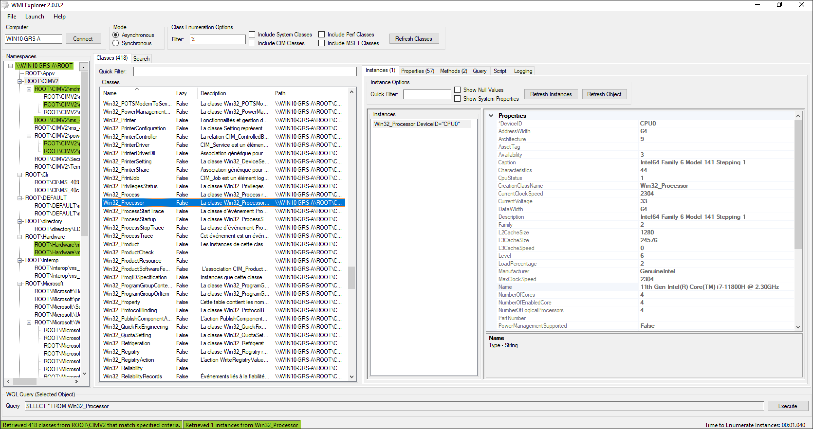


---
---

- Ecrivez un script PowerShell permettant de lister, à l’aide de WMI, les partitions de la VM Windows avec leur lettre de lecteur et de retourner le pourcentage d’espace vide.
En cas d’espace insuffisant, une alarme Syslog est générée et récupérée sur votre serveur Syslog.

> 22. Montrez votre script.


> [!tip] 
> #### Steps:
> tester si ça marche  
> possiblement besoin de Posh-SYSLOG  


#### **Réponse:**

```PowerShell
Import-Module Posh-SYSLOG
$threshold = 25
$partitions = Get-WmiObject -Class Win32_LogicalDisk -Filter "DriveType=3"

foreach ($partition in $partitions) {
    if($partition.Size -gt 0){
        $freePct = [math]::Round(($partition.FreeSpace / $partition.Size) * 100, 2)
    
        Write-Host "Drive: $($partition.DeviceID)  $($freePct)% Free `n`r    Free:  $($partition.FreeSpace) `n`r    Total: $($partition.Size)"

        if ($freePct -lt $threshold) {
            $msg = @{
                Server = "127.0.0.1"
                Port = 514
                Facility = 16
                Severity = 4
                Message = "Low free space on drive $($partition.DeviceID)  $freePct % left."
            }
            Send-SyslogMessage @msg
        }
    }
}
```


---

> 23. Montrez le résultat (valeurs obtenues et message Syslog reçu).


> [!tip] 
> #### Steps:
> screenshot l'output du script  
> si trop d'espace libre changer le threshold pour générer le syslog


#### **Réponse:**


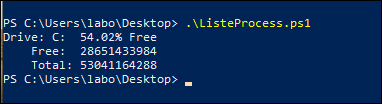

Pour obtenir uns sortie syslog, nous avons modifié le threshold, pour une valeur de 
80%.

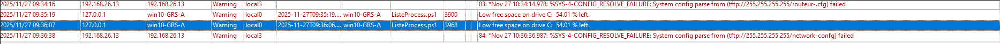


---
---

- Etablissez une souscription permanente à un événement lorsqu’un périphérique USB est
inséré dans votre système. Une notification est visible dans l’observateur d’événements. 

> 24. Montrez votre commande.


> [!tip] 
> #### Steps:
> tester si ça marche


#### **Réponse:**

```PowerShell
# WMI USB Insert logger
New-EventLog -LogName "USBInsertEvent" -Source "USBLogger"

$query = "SELECT * FROM Win32_VolumeChangeEvent WHERE EventType=2"
Register-WmiEvent -Query $query -Action {
    Write-EventLog -LogName "USBInsertEvent" -Source "USBLogger" -EventId 1 -Message "USB inserted: $($Event.SourceEventArgs.NewEvent.DriveName)"
}
```


---

> 25. Montrez l’événement reçu.


> [!tip] 
> #### Steps:
> screenshot l'event dans l'event logger de windows


#### **Réponse:**


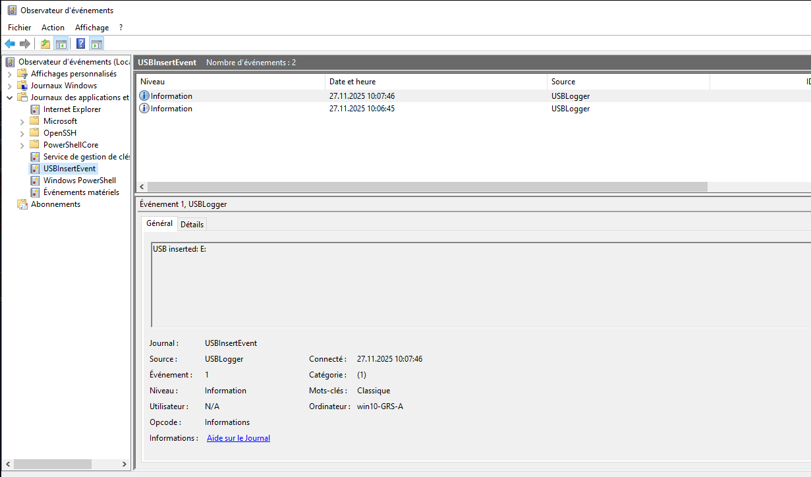